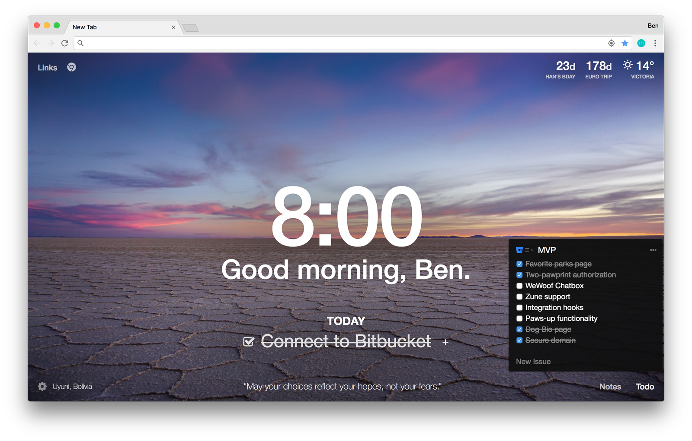

## Vue Devtools
---

> 安装后可能会出现无法使用的情况, 那么需要检查以下几种情况

?>提示 `Vue.js is detected on this page. Open DevTools and look for the Vue panel.`

 

- 点击管理扩展程序

!> 查看扩展是否开启`允许访问文件网址`

- 查看引入的vue是什么版本的

!> 如果是vue.min.js生产版本则不会显示

- 找到目录下的文件 C:\Users\Administrator\AppData\Local\Google\Chrome\User Data\Default\Extensions\nhdogjmejiglipccpnnnanhbledajbpd\4.1.5_0\\`manifest.json`

!>  把 `"persistent": false,` 改为 `"persistent": true,`

 

> 之后就可以正常使用了

 
 
 

## Momentum
---

> 一个有趣的Todo, 每日更换图片, 但是我只把他当成导航页来使用

 
 
 

## EditThisCookie

## Markdown Viewer