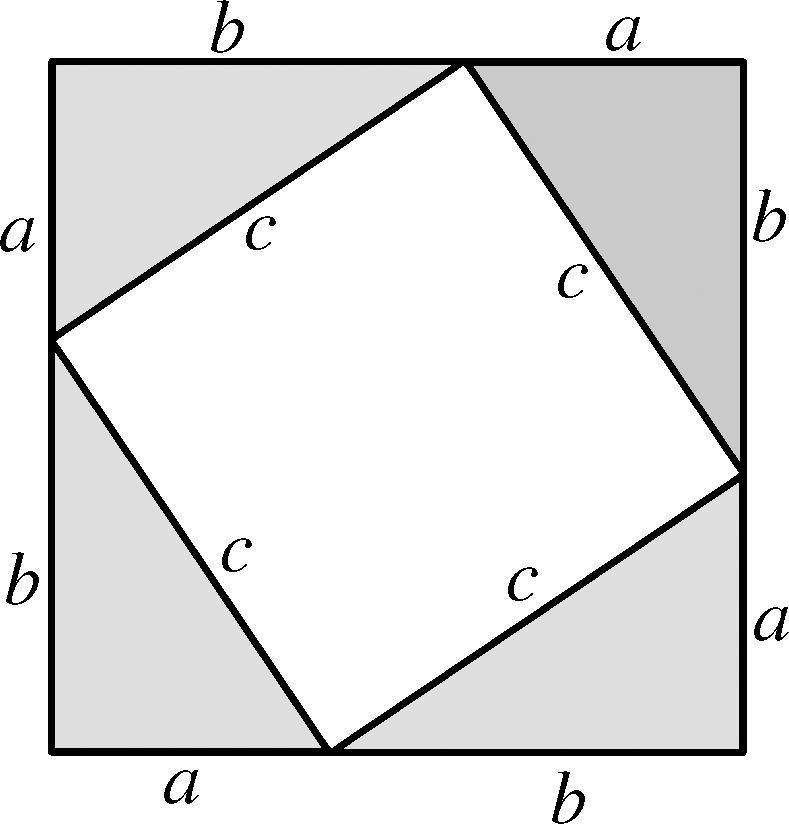
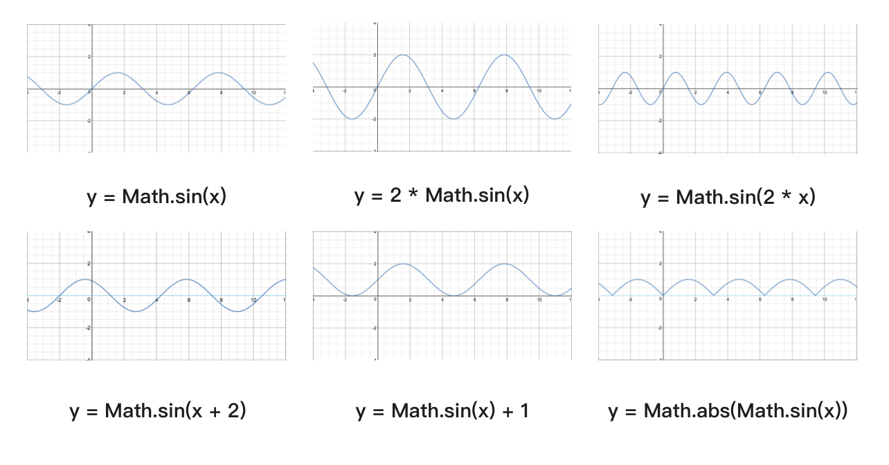
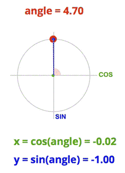

## canvas 入门
---

?> canvas是html5的新特性之一, 主要用于2d, 3d绘图技术

<br>

##### **canvas的有它的默认属性, 宽度: 300px, 高度: 150px**

```html
<!-- 如果浏览器不支持canvas这个标签, 则会显示中间的文字描述信息 -->
<canvas>你的浏览器不支持</canvas>
```

<br>

##### **使canvas铺满全屏**

canvas的宽高如果`使用css去设置会导致画布被拉伸变形`, 最好的办法是通过js使canvas的宽高等于浏览器的宽高

```js
// 使canvas与浏览器窗口大小保持一致
canvas.width = window.innerWidth
canvas.height = window.innerHeight
```

<br>

##### **去掉多余的滚动条**

这是因为`canvas是行内元素`, 有`行间距`的存在, 导致显示的宽高会比实际的宽高多出一些

```css
/* 清掉内外边距 */
body, html {
  margin: 0;
  padding: 0;
  width: 100%;
  height: 100%;
}
/* 设置为块元素 */
canvas {
  display: block;
  background-color: #333;
}
```

<br>

##### **使canvas跟着浏览器的大小一起变化**

当我们改变浏览器窗口大小时, 让canvas画布重新去获取当前窗口的宽高并进行赋值

```js
// 封装一个初始化canvas的方法
function initCanvas() {
  canvas.width = window.innerWidth
  canvas.height = window.innerHeight
}
// 页面第一次加载进行调用
initCanvas()
// 监听浏览器发生变化
window.onresize = initCanvas()
```

也可以简写成如下

```js
// 自调用函数
(function () {
  // 设置宽高
  canvas.width = window.innerWidth
  canvas.height = window.innerHeight
  // 监听浏览器发生变化
  window.onresize = arguments.callee
})();
```

<br>

### 绘制圆形、矩形
---

`rect(横坐标, 纵坐标, 宽度, 高度)`

`Ace(横坐标,纵坐标,半径,起始角度,结束角度,true表示顺时针绘制)`

<canvas id="c1" style="background-color: #222;"></canvas>

```js
// 获取canvas绘制区域
const ctx = canvas.getContext('2d')

// 绘制实心矩形
ctx.beginPath()
ctx.fillStyle = '#ffcd32'
ctx.rect(50, 50, 50, 50)
ctx.fill()

// 绘制实心圆形
ctx.beginPath()
ctx.fillStyle = '#ffcd32'
ctx.arc(125, 75, 25, 0, Math.PI*2, true)
ctx.fill()

// 绘制空心矩形
ctx.beginPath()
ctx.strokeStyle = '#ffcd32'
ctx.rect(150, 50, 50, 50)
ctx.stroke()

// 绘制空心圆形
ctx.beginPath()
ctx.strokeStyle = '#ffcd32'
ctx.arc(225, 75, 25, 0, Math.PI*2, true)
ctx.stroke()
```

<br>

### 绘制文字
---

`fillText('文字内容', 横坐标, 纵坐标)`

```html
<canvas id="canvas"></canvas>
<script>
  const ctx = canvas.getContext('2d')
  ctx.beginPath()
  ctx.font = '40px sans-serif'
  ctx.fillStyle = '#000'
  ctx.fillText('hello', 100, 100)
</script>
```

<br>

### 实例: 字母喷射效果
---

<canvas width="770" height="500" id="c3"></canvas>

> 代码

```html
<!DOCTYPE html>
<html lang="en">
<head>
  <meta charset="UTF-8">
  <title>Canvas-letter</title>
  <style>
    :root {
      --bgC: #222;
    }
    * {
      margin: 0;
      padding: 0;
    }
    canvas {
      background-color: var(--bgC);
      display: block;
    }
  </style>
</head>
<body>
  <canvas id="canvas"></canvas>
  <script>
    // 自调用函数
    (function () {
      // 设置宽高
      canvas.width = window.innerWidth
      canvas.height = window.innerHeight
      // 监听浏览器发生变化
      window.onresize = arguments.callee
    })();

    /*
    * 封装: 获取两数字之间的随机数
    * @param {Number} [min]
    * @param {Number} [max]
    * @return {Number}
    */ 
    function random(min, max) {
      return Math.floor(Math.random() * (max+1 - min) + min)
    }

    function Letter() {
      this.canvas = document.querySelector('#canvas')
      this.ctx = this.canvas.getContext('2d')
      this.W = window.innerWidth
      this.H = window.innerHeight
      this.letters = ['哈', 'ha']
      this.letter = this.letters[random(0, this.letters.length-1)]
    }
    Letter.prototype = {
      init () {
        this.x = this.W / 2
        this.y = this.H
        this.vx = (Math.random() * 8) - 4
        this.vy = (Math.random() * 8) - 4
        this.ch = 155
        this.cs = 100
        this.cl = 50
        this.ca = 0.8
        this.color = `hsla(${this.ch}, ${this.cs}%, ${this.cl}%, ${this.ca})`
      },
      draw () {
        this.ctx.font = '40px sans-serif'
        this.ctx.fillStyle = this.color
        this.ctx.fillText(this.letter, this.x, this.y)
      },
      move () {
        this.x += this.vx
        this.y += this.vy
        this.y *= 0.996
        this.ch += 0.8
        if (this.ch >= 320) {
          this.cl = 0
          this.init()
        }
        this.color = `hsla(${this.ch}, ${this.cs}%, ${this.cl}%, ${this.ca})`
        this.draw()
      }
    }

    function Game() {
      this.arr = []
      this.num = 300
      this.time = 15
      this.bgc = '#000'
    }
    Game.prototype = {
      init () {
        for (let i = 0; i < this.num; i++) {
          setTimeout(() => {
            this.letter = new Letter()
            this.letter.init()
            this.letter.draw()
            this.arr.push(this.letter)
          }, this.time * i)
        }
      },
      run () {
        setInterval(() => {
          this.letter.ctx.fillStyle = this.bgc
          this.letter.ctx.fillRect(0, 0, this.letter.W, this.letter.H)
          for (item of this.arr) {
            item.move()
          }
        }, 1000/100)
      }
    }

    const game = new Game()
    game.init()
    game.run()

    window.onresize = function () {
      window.location.reload()
    }

  </script>
</body>
</html>
```

<br>
<br>
<br>

## canvas 三角函数
---

- https://w3ctrain.com/2018/08/20/trigonometry-you-must-know/

- https://www.desmos.com/calculator/nqfu5lxaij

<br>

### 勾股定理
---

?> 勾股定理是相对于直角三角形 `a²+b²=c²` 两条边的平方和等于斜边的平方



<br>
<br>
<br>

### 常用的三角函数
---

以正弦曲线为例，对函数进行简单的变换，得到不一样的结果。



!> 正弦曲线公式：`y = A sin(Bx + C) + D`

- A 控制振幅，A 值越大，波峰和波谷越大，A 值越小，波峰和波谷越小；
- B 值会影响周期，B 值越大，那么周期越短，B 值越小，周期越长。
- C 值会影响图像左右移动，C 值为正数，图像左移，C 值为负数，图像右移。
- D 值控制上下移动。

<br>

> 绘制简单的sin曲线

```js
const ctx = canvas.getContext('2d')
const width = canvas.width
const height = canvas.height

// ctx.lineWidth = 1
ctx.strokeStyle = '#ccc'
ctx.moveTo(0, height * 0.5)

for (let x = 0; x < width; x++) {
  const y = Math.sin(x * 0.05) * 20 + height / 2
  ctx.lineTo(x, y)
}

ctx.stroke()
```

<br>
<br>
<br>

### 实例: 绘制复杂sin曲线
---

<canvas width="770" height="500" style="background-color: #333" id="c4"></canvas>

> 代码

```html
<!DOCTYPE html>
<html lang="en">
<head>
  <meta charset="UTF-8">
  <meta name="viewport" content="width=device-width, initial-scale=1.0">
  <meta http-equiv="X-UA-Compatible" content="ie=edge">
  <title>canvas-正弦sin</title>
</head>
<body>

  <style>
    html, body {
      padding: 0;
      margin: 0;
      width: 100%;
      height: 100%;
    }
    canvas {
      width: 100%;
      height: 100%;
      display: block;
      background: #232323;
    }
  </style>

  <canvas id="canvas"></canvas>

  <script>
    function valueMapping(x, inMin, inMax, outMin, outMax) {
      return (x - inMin) * (outMax - outMin) / (inMax - inMin) + outMin;
    }

    const canvas = {
      init () {
        // 获取canvas元素
        this.el = document.querySelector('#canvas')
        // 调用重置方法
        this.resize()
        // 给window注册重置事件
        window.addEventListener('resize', () => this.resize(), false)
        // 获取ctx
        this.ctx = this.el.getContext('2d')
        return this.ctx
      },
      onResize (callback) {
        // 创建一个方法, 初始化时调用
        this.resizeCallback = callback
      },
      resize () {
        // 获取宽高
        this.width = this.el.width = this.el.offsetWidth
        this.height = this.el.height = this.el.offsetHeight
        // 如果该方法存在, 则调用
        this.resizeCallback && this.resizeCallback()
      },
      run (callback) {
        // 开始循环动画
        requestAnimationFrame(() => {
          this.run(callback)
        })
        callback(this.ctx)
      }
    }

    const ctx = canvas.init()

    class Wave {
      // 构造器
      constructor(canvas, options) {
        this.canvas = canvas
        this.options = options
        this.xMove = this.options.offset
        this.xSpeed = this.options.xSpeed
        this.resize()
      }

      resize () {
        this.width = canvas.width
        this.height = canvas.height
        this.amplitude = this.canvas.height * this.options.amplitude
      }

      draw (ctx) {
        // 开始绘画
        ctx.beginPath()
        // 起点
        ctx.moveTo(0, this.height / 2)
        // 渐变色
        var grad = ctx.createLinearGradient(0, 0, this.width, 0)
        grad.addColorStop(0, this.options.start)
        grad.addColorStop(1, this.options.stop)
        ctx.strokeStyle = grad
        // 宽度
        ctx.lineWidth = this.options.lineWidth
        this.xMove += this.xSpeed
        for (let x = 0; x < this.width; x++) {
          const radians = x / this.width * Math.PI * 2
          const scale = (Math.sin(radians - Math.PI * 0.5) + 1) * 0.5
          const y = Math.sin(x * 0.02 + this.xMove) * this.amplitude * scale + this.height/2
          ctx.lineTo(x, y)
        }
        // 完成绘画
        ctx.stroke()
        // 关闭路径
        ctx.closePath()
      }
    }

    // 颜色
    const colors = [
      ['#0fd850', '#f9f047'],
      ['#007adf', '#00ecbc'],
      ['#9be15d', '#00e3ae']
    ]

    // 存储线条
    let waves = []

    // 初始化方法
    const init = () => {
      waves = []
      for (let i = 0; i < 30; i++) {
        const [start, stop] = colors[Math.floor(Math.random() * colors.length)]
        waves.push(new Wave(canvas, {
          start,
          stop,
          lineWidth: 1,
          xSpeed: valueMapping(Math.random(), 0, 1, -0.05, -0.08),
          amplitude: valueMapping(Math.random(), 0, 1, 0.05, 0.5),
          offset: Math.random() * 100
        }))
      }
    }

    // 点击时重新初始化
    document.addEventListener('click', () => {
      init()
    })

    // 先初始化一次
    init()

    canvas.run(ctx => {
      // 清除画布
      ctx.clearRect(0, 0, canvas.width, canvas.height)
      // 循环
      for (item of waves) {
        item.draw(ctx)
      }
    })

    // 屏幕发生变化时进行初始化
    canvas.onResize(() => {
      init()
    })
  </script>

</body>
</html>
```

<br>

### 极坐标系和单位圆
---

在笛卡尔直角坐标系中，任一点 (x, y) 都可以转化成极坐标表示 (r, θ)，其中

```
r = Math.sqrt(x^2 + y^2)
θ = Math.atan2(y, x)
```

!> 单位圆的定义是半径为单位长度的圆，圆上任意一点的横坐标就是对应角度的余弦值，任意点的纵坐标就是对应角度的正弦值。



<br>
<br>
<br>

## canvas 2d碰撞检测
---

> https://www.cnblogs.com/sevenyuan/p/7125642.html?from=timeline

<br>

### 实例: 粒子碰撞
---

<canvas width="100%" height="300" id="c2"></canvas>

<br>

> 碰撞检测公式

?> `Math.sqrt(Math.pow(a.x - b.x, 2) + Math.pow(a.y - b.y, 2), 2) < a.r + b.r`

<br>

> 代码

```html
<!DOCTYPE html>
<html lang="en">
<head>
  <meta charset="UTF-8">
  <title>碰撞算法</title>
  <style>
    body {
      margin: 0;
      padding: 0;
    }
    canvas {
      display: block;
    }
  </style>
</head>
<body>
  <canvas></canvas>
  <script>

    const canvas = document.querySelector("canvas")
    const ctx = canvas.getContext("2d")

    const W = window.innerWidth
    const H = window.innerHeight
    const ballArr = []
    canvas.width = W
    canvas.height = H

    const $ = {
      vMin: -5,
      vMax: 5,
      rMin: 100,
      rMax: 100,
      ballCount: 8
    }

    // 自调用函数
    ;(function () {
      // 设置宽高
      canvas.width = window.innerWidth
      canvas.height = window.innerHeight
      // 监听浏览器发生变化
      window.onresize = arguments.callee
    })();

    // 封装一个获取随机数的方法
    function random(min, max) {
      return Math.floor(Math.random() * (max+1 - min) + min)
    }

    /*
    * 封装: 判断两点之间的距离
    * 平方根 Math.pow(num, 2)
    * 开平方 Math.sqrt(num, 2)
    */
    function dir(a, b) {
      return Math.sqrt(Math.pow(a.x-b.x, 2) + Math.pow(a.y-b.y, 2), 2)
    }

    /*
    * 小球的构造函数
    */
    function Ball (x, y, vx, vy, r) {
      this.x = x
      this.y = y
      this.vx = vx
      this.vy = vy
      this.color = '#eee'
      this.r = r
    }

    /*
    * 小球的绘制方法
    */
    Ball.prototype.draw = function () {
      ctx.beginPath()
      ctx.fillStyle = this.color
      ctx.arc(this.x, this.y, this.r, 0, 2 * Math.PI)
      ctx.fill()
    }

    /*
    * 小球的刷新方法
    */
    Ball.prototype.update = function () {
      if (this.x-this.r <= 0 || this.x+this.r >= W) {
        this.vx *= -1
      }
      if (this.y-this.r <= 0 || this.y+this.r >= H) {
        this.vy *= -1
      }
      this.x += this.vx
      this.y += this.vy
    }

    /*
    * 小球的碰撞检测
    */
    Ball.prototype.collisionDetect = function () {
      for (let j = 0; j < ballArr.length; j++) {
        const ball = ballArr[j]
        // 不和自己比较
        if (this !== ball) {
          // 检测下一步将更新
          let nextx = this.x + this.vx - (ball.x + ball.vx)
          let nexty = this.y + this.vy - (ball.y + ball.vy)
          let distance = Math.sqrt(nextx * nextx + nexty * nexty)
          if (distance <= this.r + ball.r) {
            // 碰撞时弹回小球
            let dvx = this.vx - ball.vx
            let dvy = this.vy - ball.vy
            // 但更新时只需使用此步骤
            let dx = this.x - ball.x
            let dy = this.y - ball.y
            let xx_yy = dx * dx + dy * dy
            let v_dvx = (dvx * dx * dx + dvy * dx * dy) / xx_yy
            let v_dvy = (dvy * dy * dy + dvx * dx * dy) / xx_yy
            this.vx = checkSpeed(this.vx - v_dvx)
            this.vy = checkSpeed(this.vy - v_dvy)
            ball.vx = checkSpeed(ball.vx + v_dvx)
            ball.vy = checkSpeed(ball.vy + v_dvy)
          }
        }
      }
    }

    /*
    * 速度
    */
    function checkSpeed (speed) {
      if (speed > $.vMax) {
        speed = $.vMax
      } else if (speed < $.vMin) {
        speed = $.vMin
      }
      return speed
    }

    /*
    * 循环画球
    */
    function loop () {
      ctx.fillStyle = "#222"
      ctx.fillRect(0, 0, W, H)

      while (ballArr.length < $.ballCount) {
        let ball = createBall()
        ball = new Ball(ball.x, ball.y, random($.vMin, $.vMax), random($.vMin, $.vMax), ball.r)
        ballArr.push(ball)
      }

      for (item of ballArr) {
        item.draw()
        item.collisionDetect() // 更新前检测
        item.update()
      }

      // 循环
      requestAnimationFrame(loop)
    }

    const createdBalls = []

    /*
    * 确保创建的球不会碰撞
    */
    function createBall () {
      const r = random($.rMin, $.rMax)
      const ball = {
        r: r,
        x: random(0 + r, W - r),
        y: random(0 + r, H - r)
      }
      for (item of createdBalls) {
        if (dir(item, ball) < item.r + ball.r) {
          return createBall()
        }
      }
      createdBalls.push(ball)
      return ball
    }

    loop()

  </script>
</body>
</html>
```

<br>

<script>
  // c1
  (function () {
    
    const ctx = c1.getContext('2d')
    // 绘制实心矩形
    ctx.beginPath()
    ctx.fillStyle = '#ffcd32'
    ctx.rect(50, 50, 50, 50)
    ctx.fill()
    // 绘制实心圆形
    ctx.beginPath()
    ctx.fillStyle = '#ffcd32'
    ctx.arc(125, 75, 25, 0, Math.PI*2, true)
    ctx.fill()
    // 绘制空心矩形
    ctx.beginPath()
    ctx.strokeStyle = '#ffcd32'
    ctx.rect(150, 50, 50, 50)
    ctx.stroke()
    // 绘制空心圆形
    ctx.beginPath()
    ctx.strokeStyle = '#ffcd32'
    ctx.arc(225, 75, 25, 0, Math.PI*2, true)
    ctx.stroke()
  })();
  // c2
  (function () {
    const canvas = document.querySelector("#c2")
    const ctx = canvas.getContext("2d")

    const W = 770
    const H = 500
    const ballArr = []
    canvas.width = W
    canvas.height = H

    const $ = {
      vMin: -5,
      vMax: 5,
      rMin: 20,
      rMax: 50,
      ballCount: 20
    }

    // 封装一个获取随机数的方法
    function random(min, max) {
      return Math.floor(Math.random() * (max+1 - min) + min)
    }

    /*
    * 封装: 判断两点之间的距离
    * 平方根 Math.pow(num, 2)
    * 开平方 Math.sqrt(num, 2)
    */
    function dir(a, b) {
      return Math.sqrt(Math.pow(a.x-b.x, 2) + Math.pow(a.y-b.y, 2), 2)
    }

    /*
    * 小球的构造函数
    */
    function Ball (x, y, vx, vy, r) {
      this.x = x
      this.y = y
      this.vx = vx
      this.vy = vy
      this.color = '#eee'
      this.r = r
    }

    /*
    * 小球的绘制方法
    */
    Ball.prototype.draw = function () {
      ctx.beginPath()
      ctx.fillStyle = this.color
      ctx.arc(this.x, this.y, this.r, 0, 2 * Math.PI)
      ctx.fill()
    }

    /*
    * 小球的刷新方法
    */
    Ball.prototype.update = function () {
      if (this.x-this.r <= 0 || this.x+this.r >= W) {
        this.vx *= -1
      }
      if (this.y-this.r <= 0 || this.y+this.r >= H) {
        this.vy *= -1
      }
      this.x += this.vx
      this.y += this.vy
    }

    /*
    * 小球的碰撞检测
    */
    Ball.prototype.collisionDetect = function () {
      for (let j = 0; j < ballArr.length; j++) {
        const ball = ballArr[j]
        // 不和自己比较
        if (this !== ball) {
          // 检测下一步将更新
          let nextx = this.x + this.vx - (ball.x + ball.vx)
          let nexty = this.y + this.vy - (ball.y + ball.vy)
          let distance = Math.sqrt(nextx * nextx + nexty * nexty)
          if (distance <= this.r + ball.r) {
            // 碰撞时弹回小球
            let dvx = this.vx - ball.vx
            let dvy = this.vy - ball.vy
            // 但更新时只需使用此步骤
            let dx = this.x - ball.x
            let dy = this.y - ball.y
            let xx_yy = dx * dx + dy * dy
            let v_dvx = (dvx * dx * dx + dvy * dx * dy) / xx_yy
            let v_dvy = (dvy * dy * dy + dvx * dx * dy) / xx_yy
            this.vx = checkSpeed(this.vx - v_dvx)
            this.vy = checkSpeed(this.vy - v_dvy)
            ball.vx = checkSpeed(ball.vx + v_dvx)
            ball.vy = checkSpeed(ball.vy + v_dvy)
          }
        }
      }
    }

    /*
    * 速度
    */
    function checkSpeed (speed) {
      if (speed > $.vMax) {
        speed = $.vMax
      } else if (speed < $.vMin) {
        speed = $.vMin
      }
      return speed
    }

    /*
    * 循环画球
    */
    function loop () {
      ctx.fillStyle = "#222"
      ctx.fillRect(0, 0, W, H)

      while (ballArr.length < $.ballCount) {
        let ball = createBall()
        ball = new Ball(ball.x, ball.y, random($.vMin, $.vMax), random($.vMin, $.vMax), ball.r)
        ballArr.push(ball)
      }

      for (item of ballArr) {
        item.draw()
        item.collisionDetect() // 更新前检测
        item.update()
      }

      // 循环
      requestAnimationFrame(loop)
    }

    const createdBalls = []

    /*
    * 确保创建的球不会碰撞
    */
    function createBall () {
      const r = random($.rMin, $.rMax)
      const ball = {
        r: r,
        x: random(0 + r, W - r),
        y: random(0 + r, H - r)
      }
      for (item of createdBalls) {
        if (dir(item, ball) < item.r + ball.r) {
          return createBall()
        }
      }
      createdBalls.push(ball)
      return ball
    }

    loop()
  })();

  // c3
  (function () {
    /*
    * 封装: 获取两数字之间的随机数
    */ 
    function random(min, max) {
      return Math.floor(Math.random() * (max+1 - min) + min)
    }
    canvas = document.querySelector('#c3')
    function Letter() {
      this.ctx = canvas.getContext('2d')
      this.W = 770
      this.H = 500
      this.letters = ['哈', 'ha']
      this.letter = this.letters[random(0, this.letters.length-1)]
    }
    Letter.prototype = {
      init () {
        this.x = this.W / 2
        this.y = this.H
        this.vx = (Math.random() * 8) - 4
        this.vy = (Math.random() * 8) - 4
        this.ch = 155
        this.cs = 100
        this.cl = 50
        this.ca = 0.8
        this.color = `hsla(${this.ch}, ${this.cs}%, ${this.cl}%, ${this.ca})`
      },
      draw () {
        this.ctx.font = '20px sans-serif'
        this.ctx.fillStyle = this.color
        this.ctx.fillText(this.letter, this.x, this.y)
      },
      move () {
        this.x += this.vx
        this.y += this.vy
        this.y *= 0.99
        this.ch += 0.8
        if (this.ch >= 320) {
          this.cl = 0
          this.init()
        }
        this.color = `hsla(${this.ch}, ${this.cs}%, ${this.cl}%, ${this.ca})`
        this.draw()
      }
    }

    function Game() {
      this.arr = []
      this.num = 300
      this.time = 15
      this.bgc = '#000'
    }
    Game.prototype = {
      init () {
        for (let i = 0; i < this.num; i++) {
          setTimeout(() => {
            this.letter = new Letter()
            this.letter.init()
            this.letter.draw()
            this.arr.push(this.letter)
          }, this.time * i)
        }
      },
      run () {
        setInterval(() => {
          this.letter.ctx.fillStyle = this.bgc
          this.letter.ctx.fillRect(0, 0, this.letter.W, this.letter.H)
          for (item of this.arr) {
            item.move()
          }
        }, 1000/100)
      }
    }

    const game = new Game()
    game.init()
    game.run()
  })();

  (function () {
    function valueMapping(x, inMin, inMax, outMin, outMax) {
      return (x - inMin) * (outMax - outMin) / (inMax - inMin) + outMin;
    }

    const canvas = {
      init () {
        // 获取canvas元素
        this.el = document.querySelector('#c4')
        // 调用重置方法
        this.resize()
        // 给window注册重置事件
        window.addEventListener('resize', () => this.resize(), false)
        // 获取ctx
        this.ctx = this.el.getContext('2d')
        return this.ctx
      },
      onResize (callback) {
        // 创建一个方法, 初始化时调用
        this.resizeCallback = callback
      },
      resize () {
        // 获取宽高
        this.width = this.el.width = this.el.offsetWidth
        this.height = this.el.height = this.el.offsetHeight
        // 如果该方法存在, 则调用
        this.resizeCallback && this.resizeCallback()
      },
      run (callback) {
        // 开始循环动画
        requestAnimationFrame(() => {
          this.run(callback)
        })
        callback(this.ctx)
      }
    }

    const ctx = canvas.init()

    class Wave {
      // 构造器
      constructor(canvas, options) {
        this.canvas = canvas
        this.options = options
        this.xMove = this.options.offset
        this.xSpeed = this.options.xSpeed
        this.resize()
      }

      resize () {
        this.width = canvas.width
        this.height = canvas.height
        this.amplitude = this.canvas.height * this.options.amplitude
      }

      draw (ctx) {
        // 开始绘画
        ctx.beginPath()
        // 起点
        ctx.moveTo(0, this.height / 2)
        // 渐变色
        var grad = ctx.createLinearGradient(0, 0, this.width, 0)
        grad.addColorStop(0, this.options.start)
        grad.addColorStop(1, this.options.stop)
        ctx.strokeStyle = grad
        // 宽度
        ctx.lineWidth = this.options.lineWidth
        this.xMove += this.xSpeed
        for (let x = 0; x < this.width; x++) {
          const radians = x / this.width * Math.PI * 2
          const scale = (Math.sin(radians - Math.PI * 0.5) + 1) * 0.5
          const y = Math.sin(x * 0.02 + this.xMove) * this.amplitude * scale + this.height / 2
          ctx.lineTo(x, y)
        }
        // 完成绘画
        ctx.stroke()
        // 关闭路径
        ctx.closePath()
      }
    }

    // 颜色
    const colors = [
      ['#0fd850', '#f9f047'],
      ['#007adf', '#00ecbc'],
      ['#9be15d', '#00e3ae']
    ]

    // 存储线条
    let waves = []

    // 初始化方法
    const init = () => {
      waves = []
      for (let i = 0; i < 30; i++) {
        const [start, stop] = colors[Math.floor(Math.random() * colors.length)]
        waves.push(new Wave(canvas, {
          start,
          stop,
          lineWidth: 1,
          xSpeed: valueMapping(Math.random(), 0, 1, -0.05, -0.08),
          amplitude: valueMapping(Math.random(), 0, 1, 0.05, 0.5),
          offset: Math.random() * 100
        }))
      }
    }

    // 先初始化一次
    init()

    canvas.run(ctx => {
      // 清除画布
      ctx.clearRect(0, 0, canvas.width, canvas.height)
      // 循环
      for (item of waves) {
        item.draw(ctx)
      }
    })
  })();
  
</script>