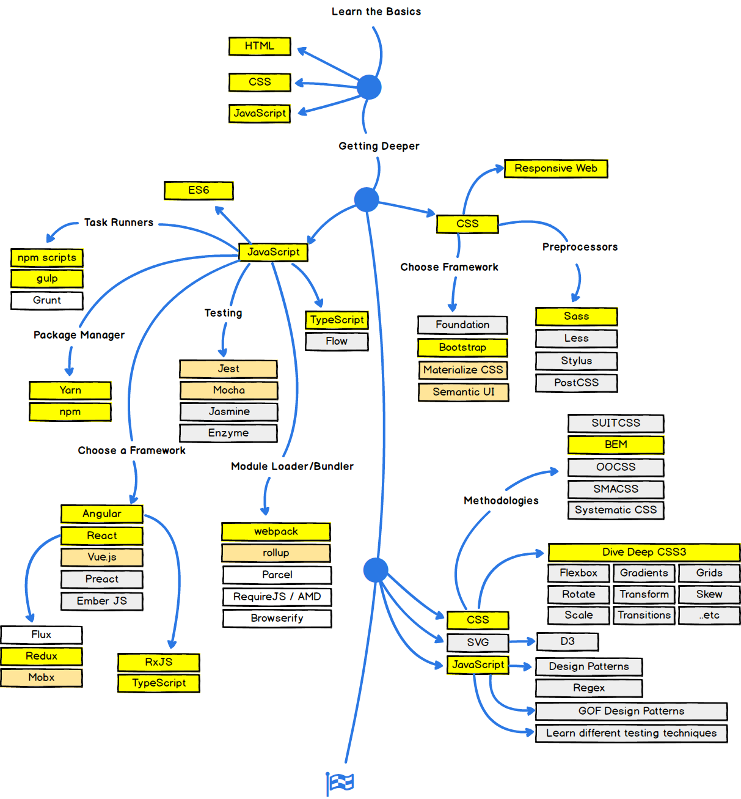

- 你在书本上学到的、你的父母告诉你的，可能不全是真的，这个世界太有趣了，这个世界太独特了，你需要自己去体验。你需要用你自己的大脑去思考。

- 代码段

  - 生成8位随机数字 `Math.random().substring(2, 10)`

  - 生成8位随机字母加数字 `Math.random().toString(16).substring(2, 8)`

  - 转换货币书写格式 `'123456789'.replace(/\B(?=(\d{3})+(?!\d))/g, ',')`

  - jQuery回到顶部 `$("html,body").animate({scrollTop:0},500)`
