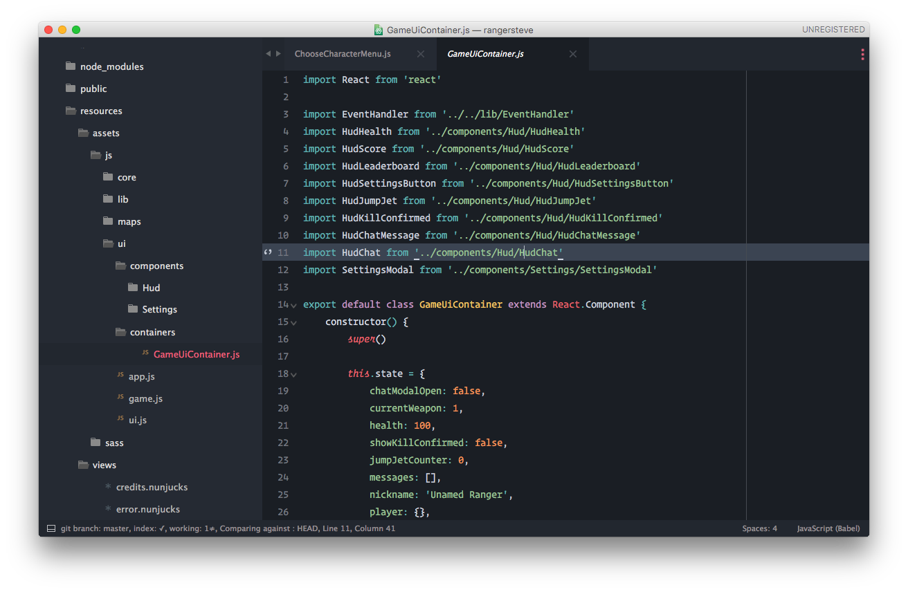
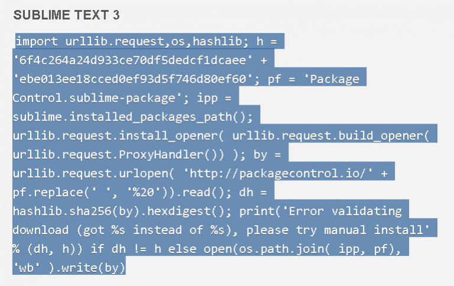
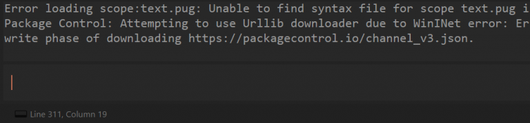
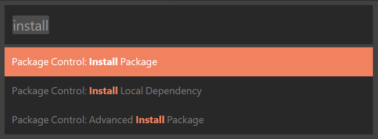
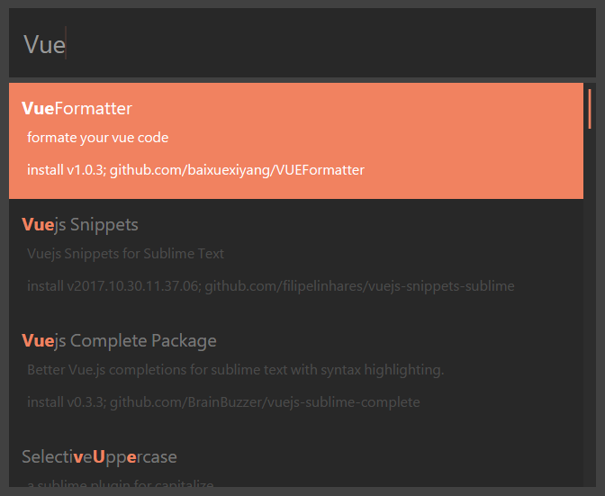

## Sublime Text 是一款强大的轻量级开发工具



### 安装插件

> 第一步，进入[installation](https://packagecontrol.io/installation)网站复制以下一堆代码



<br>

> 打开sublime按下 <code>Ctrl+`</code> 进入命令行模式，粘贴然后回车，进行等待




<br>

> 第二步，在sublime中按下Ctrl+Shift+p输入install可以看到一堆提示，直接按回车，后面两个不用管，接下来又是等待



<br>

> 第三步，现在想安装什么插件都可以输入了



<br>

#### 我个人安装了以下插件

插件名 | 注释
--- | ---
Emmet                 | 快捷键补全功能
Bracket Highlighter   | 可以帮助我匹配代码节点
Themr                 | 主题管理,可以很方便的切换主题
autofilename          | 可以拥有路径提示
Vue Syntax Highlight  | 可以识别.vue后缀的文件
Agila                 | 个人比较喜欢的一款主题配色
SideBarEnhancements   | 侧边栏功能增强

<br>

### 个人配置

> 以下配置在工具栏 Preferences > Settings 中进行编辑

```json
{
  "color_scheme": "Packages/Agila Theme/Agila Oceanic Next.tmTheme",
  "font_face": "Monaco",
  "font_size": 15,
  "ignored_packages":
  [
    "Vintage"
  ],
  "tab_size": 2,
  "theme": "Agila.sublime-theme",
  "translate_tabs_to_spaces": true
}
```