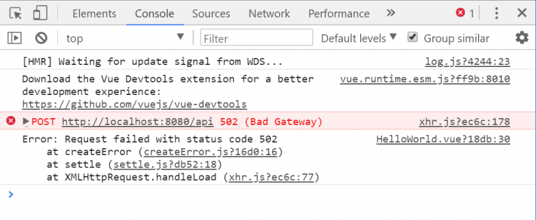

## 如何在vue中引入jQuery
---

> 首先`npm i jquery`安装jquery

- 找到`build/webpack.base.conf.js`文件

  - 在前面引入`const webpack = require("webpack")`

  - 然后在`module.exports`中加入如下代码

```js
plugins: [
  new webpack.optimize.CommonsChunkPlugin('common.js'),
  new webpack.ProvidePlugin({
    jQuery: "jquery",
    $: "jquery"
  })
]
```

<br>
<br>
<br>

## vue中处理icon图标不显示

- 在`index.html`中添加

```html
<link rel="shortcut icon" type="image/x-icon" href="favicon.ico"/>
```

- 找到`build/webpack.dev.conf.js`增加一行代码

```js
new HtmlWebpackPlugin({
  filename: 'index.html',
  template: 'index.html',
  inject: true,
  favicon: path.resolve('favicon.ico') // 增加
}),
```

- 找到`build/webpack.prod.conf.js`增加一行代码

```js
new HtmlWebpackPlugin({
  filename: config.build.index,
  template: 'index.html',
  inject: true,
  favicon: path.resolve('favicon.ico'), //新增
  minify: {
    removeComments: true,
    collapseWhitespace: true,
    removeAttributeQuotes: true
    ...
}),
```

<br>
<br>
<br>

## proxy代理跨域请求聚合数据接口
---

整理遇到的问题与`坑`

> 第一个坑 跨域

```vue
<template>
  <div></div>
</template>

<script>
import axios from 'axios'

export default {
  name: 'HelloWorld',
  data () {
    return {
      news: []
    }
  },
  created () {
    this.getNews()
  },
  methods: {
    getNews () {
      axios.post('http://v.juhe.cn/toutiao/index', {
        // type可以为空
        type: '',
        // key是我随便从百度找的, 如有冒犯我会立即删除
        key: '079b794e481cd03ae363d5b4a4eddd57'
      })
        .then(res => {
          console.log(res)
        })
        .catch(err => {
          console.log(err)
        })
    }
  }
}
</script>

<style scoped>

</style>
```

此时我们的命令行展示了第一个坑, 跨域


如何解决跨域？

在[相关文档](https://vuejs-templates.github.io/webpack/proxy.html)中我们得知`proxyTable`能解决开发环境的跨域问题

于是我们配置找到`demo>config>index.js`

```js
proxyTable: {},
```

!> 我们看到第13行的`proxyTable`的配置项为空, 于是我们添加自己的配置

```js
proxyTable: {
  "/api": {
    target: "http://v.juhe.cn/toutiao/index"
  },
},
```

最后修改完配置文件需要重新`npm run dev`

此时的命令行已经看不到跨域的报错了, 但又出现了第二个坑, 404!

<br>

> 第二个坑！请求数据404


出现该错误的原因是因为`target`会把`http://v.juhe.cn/toutiao/index`代理到`http://v.juhe.cn/toutiao/index/api`

这个接口肯定是不存在的, 我们需要把`/api`去掉, 才能匹配到正确的路径

正好`pathRewrite`可以满足我们的要求, 它会匹配`"/api"`然后替换成空字符串`""`

```js
proxyTable: {
  "/api": {
    target: "http://v.juhe.cn/toutiao/index",
    // pathRewrite会重写为
    // 正确的路径http://v.juhe.cn/toutiao/index
    pathRewrite: {"^/api": ""}
  },
},
```

最后修改完配置文件需要重新`npm run dev`

再次刷新之后我们发现404的错误已经没有了, 但是又出现了新的错误502

<br>

> 第三个坑！错误信息502



解决502很容易, 因为请求聚合数据的接口需要携带两个参数, 所以添加`changeOrigin: true`就可以了

```js
proxyTable: {
  "/api": {
    target: "http://v.juhe.cn/toutiao/index",
    pathRewrite: {"^/api": ""},
    // changeOrigin请求时允许携带参数
    changeOrigin: true
  },
},
```

最后修改完配置文件需要重新`npm run dev`

现在终于能请求到接口了, 但似乎还有一些问题, 我们看到data中显示`错误的请求KEY`


<br>

> 最后一个坑！不支持的数据格式

此时我们到了最后一个坑, 也是最难以发现的坑

根据命令行的提示, `错误的请求KEY`我们的key有问题吗？

key是聚合数据提供的, 出问题的几率很小, 但不妨我们测试一下

我直接把`http://v.juhe.cn/toutiao/index?type=&key=079b794e481cd03ae363d5b4a4eddd57`放在地址栏按回车


可以看到确实是有数据的, 而且key也是正确的

那问题出在哪了？

?> 问题出在聚合数据后台不接受json格式的数据参数

axios会自动把参数转换成json格式进行传输, 而聚合数据则是要`application/x-www-form-urlencoded`格式的数据

因为数据格式错误, 后台无法识别, 所以才会提示错误的key

那我们的`getNews()`方法则应该改成这样

```js
getNews () {
  var params = new URLSearchParams()
  params.append('type', 'caijing')
  params.append('key', '079b794e481cd03ae363d5b4a4eddd57')
  axios.post('/api', params)
    .then(res => {
      this.news = res.data.result.data
      console.log(res)
      // 保存数据
      this.news = res.data.result.data
    })
    .catch(err => {
      console.log(err)
  })
}
```

最后终于填满所有的坑, 大功告成


<br>
<br>
<br>

## react渲染组件时去掉最外层根标签
---

组件内部直接把根标签换成`<Fragment></Fragment>`即可

```js
import React, { Fragment } from 'react'

class App extends React.Component {
  render () {
    return (
      <Fragment>
        内容
      </Fragment>
    )
  }
}

export default App
```

<br>

## react对父组件传来的数据进行校验
---

官网提供的脚手架工具里面自带了相关的包, 只需要引入即可

- [更多校验规则 - 官方API](https://reactjs.org/docs/typechecking-with-proptypes.html)

```js
import PropTypes from 'prop-types'

class App extends React.Component {

  static propTypes = {
    // 要求接收的name必须是一个字符串, 并且非空
    name: PropTypes.string.isRequired,
    // 要求接收的name必须是一个字符串或者数字
    age: PropTypes.oneOfType(PropTypes.number, PropTypes.string)
    // 要求接收的sayHi必须是一个方法
    sayHi: PropTypes.func
  }

  static defaultProps = {
    name: 'jack'
  }

  render () {
    const { name, age, sayHi } = this.props
    return (
      <p onClick={sayHi}>我的名字叫{name}, 今年{age}岁</p>
    )
  }
}

export default App
```

<br>

## react中setState的回调函数
---

在react中, `this.setState()`是一个异步的函数, 可能出现的一种情况就是, 后面的代码无法使用到最新的数据

```js
import React from 'react'

export default class App extends React.Component {
  constructor () {
    super()
    this.state = {
      num: 10
    }
  }
  render () {
    return (
      <div>
        <button onClick={() => this.showNum()}>按钮</button>
      </div>
    )
  }
  showNum () {
    this.setState({
      num: 99
    }, () => {
      console.log(this.state.num) // 打印结果为 99
    })
    console.log(this.state.num) // 打印结果为 10
  }
}
```

解决办法就是使用`this.setState()`提供的回调函数来解决异步所带来的问题

!> 又或者可以通过`ES7`的`async await`来使代码变成同步的

```js
import React from 'react'

export default class App extends React.Component {
  constructor () {
    super()
    this.state = {
      num: 10
    }
  }
  render () {
    return (
      <div>
        <button onClick={() => this.showNum()}>按钮</button>
      </div>
    )
  }
  async showNum () {
    await this.setState({
      num: 99
    }, () => {
      console.log(this.state.num) // 打印结果为 99
    })
    console.log(this.state.num) // 打印结果为 99
  }
}
```
