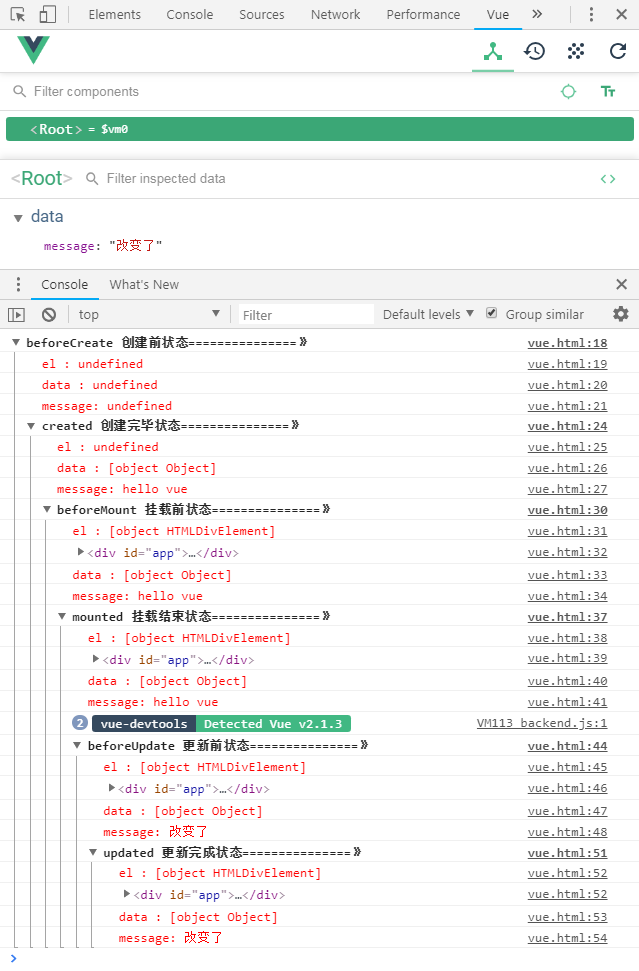

- `vue官方中文文档` https://cn.vuejs.org/
- `vue-router文档` https://router.vuejs.org/zh/

<br>

`$event`可以手动传递事件参数对象

## vue常用属性
---

> ### 数据渲染 `{{}}`

数据单向绑定

```vue
<p>{{msg}}</p>
```

<br>

> ### 数据渲染 `v-html`

会解析并渲染标签，将数据插入到标签中

```vue
<p v-html="data"></p>
```

<br>

> ### 一次性绑定 `v-once`

```vue
<p v-once="data"></p>
```

<br>

> ### 数据双向绑定 `v-model`

```vue
<input type="text" v-model="data">
```

<br>

> ### 条件判断 `v-if/v-else`

该属性会对DOM树进行操作，对内容进行重新渲染

```vue
<div>
  <span v-if="sex === 1">男</span>
  <span v-else-if="sex === 0">女</span>
  <span v-else></span>
</div>
```

<br>

> ### 隐藏显示 `v-show`

该属性仅仅只是改变display，不会对DOM树进行操作

```vue
<div v-show="true"></div>
```

<br>

> ### 列表渲染 `v-for`

!> 当数据发生变化, 列表会进行重新渲染, 数据量过大时, 有可能会导致页面出现卡顿. 如果给每一个列表加上一个自定义属性 `v-bind:key=""` 的话就相当于把数据和 DOM 绑定了起来. 绑定key的值也必须是唯一的, 列表也不会重新进行渲染, 而是只改那一条数据, 对整体页面加载速度进行了优化.

```vue
<div id="app">
  <li v-for="(item, index) in city" :key="index" v-html="item"></li>
</div>

<script>
  new Vue({
    el: '#app',
    data () {
      return {
        city: ['北京', '上海', '广州', '深圳']
      }
    }
  })
</script>
```

<br>

### 按键修饰符
---

> 回车按键 `.enter`

```
// 当按下回车键时触发
<input type="text" v-on:keydown.enter="sub">
```

> 以此类推还有更多的按键修饰符

```
.tab (按tab键时触发)
.esc (按esc键时触发)
.space (按space键时触发)
.up (按up键时触发)
.left (按left键时触发)
.right (按right键时触发)
.down (按down键时触发)
.ctrl (按ctrl键时触发)
.alt (按alt键时触发)
.shift (按shift键时触发)
.字母 (按字母键时触发)
```

<br>
<br>
<br>

## vue常用方法
---

> ### methods 方法

methods用来存放存放一些封装的方法，然后在钩子函数或事件中进行调用

```vue
<script>
export default {
  methods: {
    getMsg (id) {
      console.log(id)
    }
  }
}
</script>
```

<br>

> ### filters 过滤器

- methods中的方法调用时：方法名(参数)
- 过滤器中的方法调用时：参数 | 方法名

```vue
<script>
export default {
  filters: {
    getData (id) {
      // 结果为 window 对象
      console.log(this)
    } 
  },
  methods: {
    getMsg (id) {
      // 结果为 vue 实例
      console.log(this)
    }
  }
}
</script>
// 调用 methods 中的方法
<button @click="handler(id)">按钮</button>
// 调用过滤器中的方法
<button @click="id | handler">按钮</button>
```

- methods中的this指向vue实例
- 过滤器中的this指向windows对象


- methods放一些普通方法
- 过滤器一般就是做数据的格式化，或者统一的转换处理

<br>

> ### computed 属性计算

computed同样是用于封装方法，与methods的区别是在调用时，不需要加括号

并且只有当数据变化时，才会被执行，可以避免性能消耗

```
<template>
  <div>
    <p>两个数字的和为{{sub}}</p>
  </div>
</template>
<script>
export default {
  data () {
    return {
      num1: 3,
      num2: 2
    }
  },
  computed: {
    sub () {
      return this.num1 + this.num2
    }
  }
}
</script>
```

<br>

> ### watch 观察者

监视数据的变化

```
<script>
export default {
  watch: {
    // 监视当msg产生变化时调用
    'msg': function () {
      console.log('msg变化了')
    }
  }
}
</script>
```

<br>
<br>
<br>

## vue路由
---

### 路由参数

```html
<span>{{$route.params.id}}</span>
<span>{{$route.query.id}}</span>
```

### 路由跳转

```js
$router.push('name')
$router.push({path: 'name'})

$router.push({path: 'name?a=101'})
$router.push({path: 'name', query: {a: 101}})

$router.go(1)
```

### router-link

```html
<router-link to="/cart">购物车</router-link>

<router-link :to="{name: 'cart'}">购物车</router-link>

<router-link :to="{name: 'cart', params: {id: 1024}}">购物车</router-link>
```

```js
{
  path: '/cart',
  name: 'cart',
  component: Cart
}
```

### router-view

```html
<router-view></router-view>
<router-view name="title"></router-view>
<router-view name="img"></router-view>
```

```js
import GoodsList from '@/views/GoodsList'
import Title from '@/views/Title'
import Img from '@/views/Img'
import Cart from '@/views/Cart'

Vue.use(Router)

export default new Router({
  routes: [
    {
      path: '/',
      components: {
        default: GoodsList,
        title: Title,
        img: Img
      }
    }
  ]
})
```

<br>
<br>
<br>


<br>
<br>
<br>

## vue生命周期
---



| 钩子函数 | 周期
| --- | ---
| `beforeCreated` | 组件实例刚被创建，组件属性计算之前
| `created`       | 组件实例创建完成，属性已绑定，DOM还未生成，$el不存在
| `beforeMounted` | 模版被渲染成html之前
| `mounted`       | 模板被渲染成html之后，此时可以操作DOM元素
| `beforeUpdate`  | 组件更新之前
| `updated`       | 组件更新之后
| `beforeDestroy` | 组件被销毁之前调用
| `destroyed`     | 组件被销毁之后调用

<br>
<br>
<br>

## vuex
---

- 安装 `npm i vuex`

<br>

- 在`src`目录下创建一个store目录, 在`index.js`文件中写入代码

```js
import Vue from 'vue'
import Vuex from 'vuex'

Vue.use(Vuex)

// 可以通过this.$store.state访问数据
const store = new Vuex.Store({
  state: {
    count: 0,
    todos: [
      { id: 1, title: '吃饭', done: true },
      { id: 2, title: '睡觉', done: false },
      { id: 3, title: '打豆豆', done: true }
    ]
  },

  // mutation 相当于state中的 methods
  mutations: {
    increment (state) {
      state.count++
    }
  },

  // getters 相当于state中的计算属性
  geeters: {
    doneTodos (state) {
      return state.todos.filter(t => t.done)
    }
  }
})

export default store
```

<br>

- 然后在`main.js`中引入store并添加到vue实例中

```js
import Vue from 'vue'
import App from './App'
import router from './router'
import store from './store'

Vue.config.productionTip = false

/* eslint-disable no-new */
new Vue({
  el: '#app',
  store,
  router,
  render: h => h(App)
})
```

<br>

- 使用方式推荐使用属性计算, 如果需要修改`store`的数据, 则需要在`store`中定义方法

```html
<template>
  <div>
    <span v-html="count"></span>
    <span v-html="$store.state.count"></span>
    <button @click="addCount">增加 +</button>
  </div>
</template>

<script>
import { mapState } from 'vuex'

export default {
  data () {
    return {}
  },

  computed: {
    // ...mapState({
    //   count (state) {
    //     return state.count
    //   }
    //
    //   es6 箭头函数简写
    //   count: state => state.count,
    //
    //   等同于上面的写法
    //   count: 'count',
    // }),

    // 简写
    ...mapState(['count', 'foo', 'bar']),
    ...mapGetters(['doneTodos']),
  },

  methods: {
    addCount () {
      // 不要直接修改store中的数据
      // this.$store.state.count++

      // 而是调用store中的方法
      this.$store.commit('increment')
    }
  }
}
</script>
```

<br>
<br>
<br>